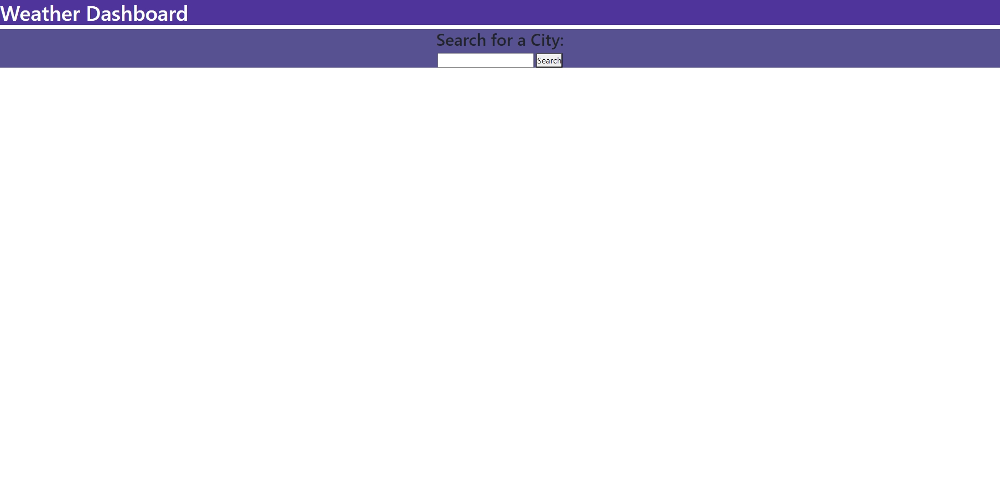
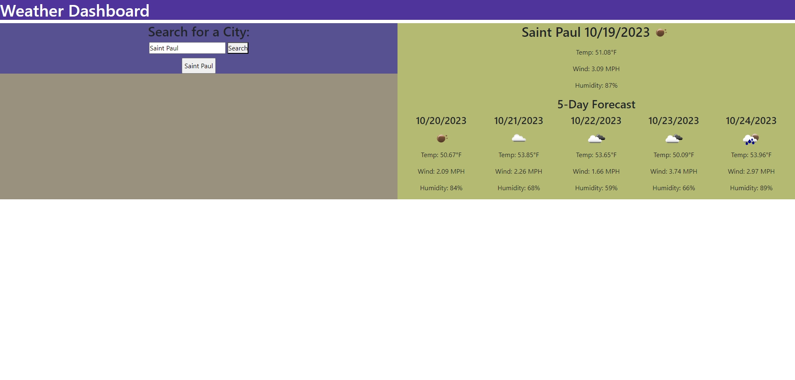
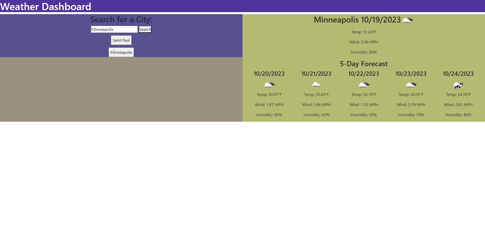
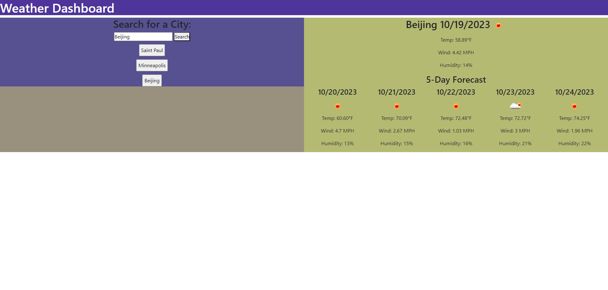
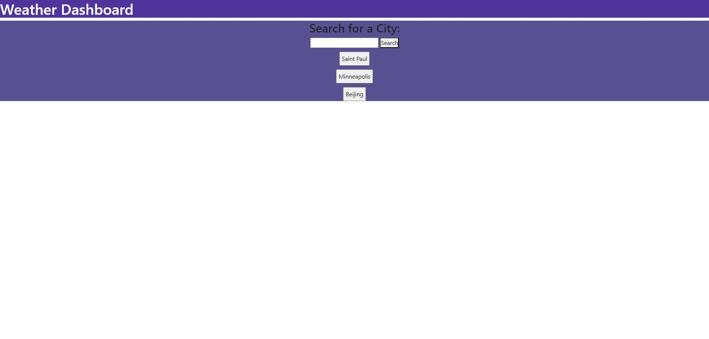

# Weather Forecast

## Description

- The motivation was to create a webpage to help users to see the current weather along with the next five days.
- I build this project to help users be able to see the weather ahead.
- It solves the problem of having to see cities weather using other tools/software.
- I learned that there needs to be arrangement of the code in order to make it work along with structuring the data.

## Table of Contents (Optional)

If your README is long, add a table of contents to make it easy for users to find what they need.

- [Installation](#installation)
- [Usage](#usage)
- [Credits](#credits)
- [License](#license)
- [Badges](#badges)
- [Features](#features)
- [HowToContribute](#how-to-contribute)
- [Test](#tests)

## Installation

To install the project, you will need to download the folder and then open it through any internet browser.

GitHub Link: https://github.com/Jasony95/weather-dashboard

GitHub Page: https://jasony95.github.io/weather-dashboard/

## Usage

Main Page without using Localstorage

After searching Saint Paul

After searching Minneapolis

After searching Beijing

After selecting Saint Paul Button under search

Refreshing The Page After Using LocalStorage

Clicking on Minneapolis Button

## Credits

Collaborators:

1. Sichoun Nplhaib Lee: https://github.com/DDXP3

2. Joey Thao: https://github.com/Thaodev23

Sources Used:

1. https://openweathermap.org/forecast5
2. https://coding-boot-camp.github.io/full-stack/apis/how-to-use-api-keys
3. https://www.geeksforgeeks.org/how-to-parse-float-with-two-decimal-places-in-javascript/
4. https://openweathermap.org/current#fields_json
5. https://openweathermap.org/forecast5#example_JSON
6. https://www.w3schools.com/charsets/tryit.asp?deci=8457
7. https://www.w3schools.com/charsets/ref_utf_letterlike.asp
8. https://stackoverflow.com/questions/44177417/how-to-display-openweathermap-weather-icon
9. https://api.jquery.com/remove/
10. https://www.w3schools.com/jsref/tryit.asp?filename=tryjsref_tofixed
11. https://stackoverflow.com/questions/40985620/updating-localstorage-arrays-in-javascript
12. https://www.geeksforgeeks.org/how-to-store-an-array-in-localstorage/
13. https://developer.mozilla.org/en-US/docs/Web/API/Storage/getItem
14. https://www.tutorialrepublic.com/faq/how-to-bind-click-event-to-dynamically-added-elements-in-jquery.php
15. https://www.tutorialrepublic.com/codelab.php?topic=faq&file=jquery-bind-click-event-to-dynamically-created-elements
16. https://www.youtube.com/watch?v=eKlBJFsiyX4&ab_channel=KnowledgeBase
17. https://developer.mozilla.org/en-US/docs/Web/JavaScript/Reference/Global_Objects/Array/includes
18. https://openweathermap.org/api/geocoding-api

## License

There is no usage for the license.

## Badges

No badges are used are displayed.

## Features

-Webpage searches for cities and forecast the current and five days.
-Users can switch to cities that have been searched before.
-Cities will still be displayed in the main page and can be clicked to show the current and five day weather.

## How to Contribute

No contribution are needed.

## Tests

There are no test to implement.